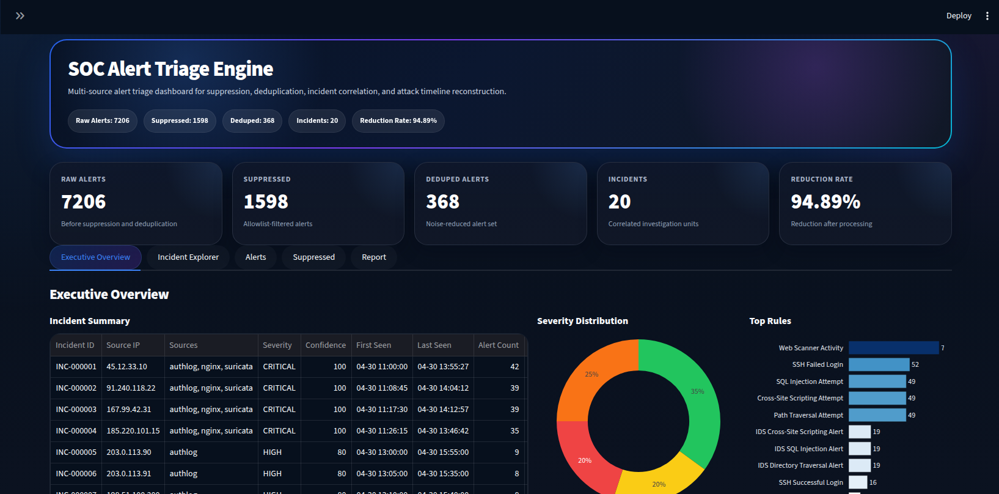
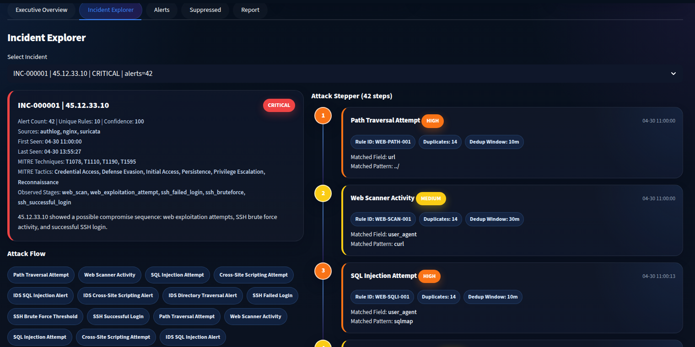
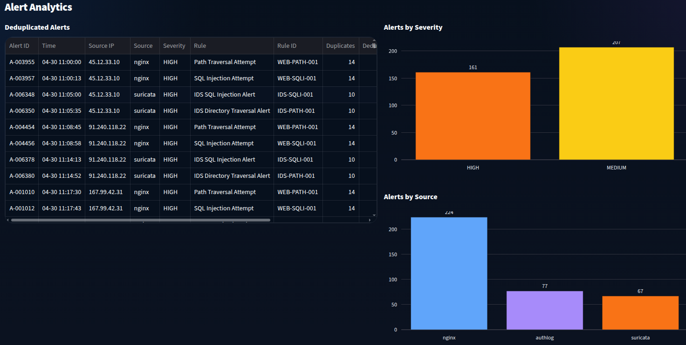

# SOC Alert Triage Engine

[한국어](README.ko.md) | English


A multi-source SOC alert triage and incident correlation project that parses Nginx access logs, Linux auth logs, and Suricata EVE JSON alerts, then applies rule-based detection, policy-based suppression, deduplication, sequence-based severity scoring, MITRE ATT&CK enrichment, and dashboard/report generation.

This project is designed as a portfolio-grade security engineering project focused on alert triage automation, false-positive reduction, and attack timeline reconstruction.

## Overview

Modern SOC environments often receive large volumes of repetitive alerts from multiple log sources. This project simulates that workflow by collecting raw events from web, authentication, and IDS sources, then reducing alert noise and grouping related alerts into investigation-ready incidents.

The pipeline converts raw logs into normalized events, applies detection rules and threshold logic, suppresses known-benign alerts, deduplicates repeated alerts by rule-specific windows, correlates alerts by source IP, reconstructs attack timelines, enriches incidents with MITRE ATT&CK context, and outputs both JSON artifacts and a Markdown incident report.

## Dashboard Preview

### Executive Overview



### Incident Explorer



### Alert Analytics



## Key Features

- Multi-source log parsing
  - Nginx `access.log`
  - Linux `auth.log`
  - Suricata `eve.json`
- Rule-based detection engine using YAML rules
- Threshold-based SSH brute-force detection
- Policy-based false-positive suppression engine
- Rule-specific deduplication windows
- Multi-source incident correlation by source IP
- Sequence-based severity and confidence scoring
- MITRE ATT&CK technique and tactic mapping
- Attack timeline reconstruction
- Streamlit dashboard with incident explorer and attack stepper UI
- Analyst-oriented Markdown incident report generation
- Synthetic SOC demo log generator
- CLI-based analysis execution
- GitHub Actions CI for automated testing

## Detection Pipeline

```text
Raw Logs
  ├─ Nginx access.log
  ├─ Linux auth.log
  └─ Suricata eve.json
        ↓
Normalized Events
        ↓
Rule Matching + Threshold Detection
        ↓
Policy-based Suppression
        ↓
Rule-specific Deduplication
        ↓
Incident Correlation
        ↓
Sequence Scoring + MITRE Enrichment
        ↓
Dashboard / JSON Outputs / Markdown Report
```

## Supported Data Sources

| Source | File | Example Event Type |
|---|---|---|
| Nginx | `samples/nginx_access.log` | Web scan, SQL injection, XSS, path traversal |
| Linux auth.log | `samples/auth.log` | SSH failed login, SSH successful login, brute force threshold |
| Suricata EVE JSON | `samples/suricata_eve.json` | IDS SQLi, XSS, traversal, scan, SSH brute force alert |

## Detection Coverage

Example rule categories:

| Rule Area | Example Rule IDs | Purpose |
|---|---|---|
| Web attack detection | `WEB-SQLI-001`, `WEB-XSS-001`, `WEB-PATH-001` | Detect suspicious web requests from Nginx logs |
| Web scanner detection | `WEB-SCAN-001` | Detect scanner-like requests and suspicious paths |
| SSH authentication | `SSH-FAIL-001`, `SSH-SUCCESS-001` | Detect SSH login failures and successful logins |
| SSH threshold detection | `SSH-BRUTEFORCE-001` | Detect repeated failed SSH login bursts |
| IDS alert detection | `IDS-SQLI-001`, `IDS-XSS-001`, `IDS-PATH-001`, `IDS-SCAN-001`, `IDS-SSH-BRUTEFORCE-001` | Detect Suricata IDS signatures |

## Suppression Policy Engine

The suppression engine removes known-benign or approved activity before deduplication and incident correlation. This reduces false positives and keeps incident output focused on investigation-worthy alerts.

Supported suppression policy types:

- Known SSH login allowlist
- Specific `rule_id + src_ip` suppression
- Trusted network-based suppression
- User-Agent based suppression
- Path-based suppression
- Trusted service suppression
- Maintenance window suppression

Example policy:

```yaml
allowed_ssh_logins:
  - src_ip: 203.0.113.77
    user: jamong
    reason: Known administrator login from trusted IP

suppressed_rules:
  - rule_id: WEB-SCAN-001
    src_ip: 198.51.100.10
    reason: Internal vulnerability scanner

suppressed_user_agents:
  - user_agent_contains: Uptime-Kuma
    rule_id: WEB-SCAN-001
    reason: Internal uptime monitoring probe

trusted_networks:
  - cidr: 203.0.113.0/24
    suppress_event_types:
      - ssh_success_login
    reason: Trusted administration network
```

## Deduplication

The project supports rule-specific deduplication settings through YAML rules.

Example:

```yaml
dedup:
  key:
    - src_ip
    - rule_id
  window_minutes: 30
```

This allows noisy scan-type alerts and high-value exploit alerts to use different deduplication windows.

## Sequence-based Severity Scoring

Incidents are scored based on observed attack stages. For example:

```text
Web exploitation attempt
+ SSH brute force
+ SSH successful login
= Critical compromise sequence
```

Example severity scenarios in the synthetic dataset:

| Severity | Scenario |
|---|---|
| Critical | Web exploitation + SSH brute force + SSH success + IDS evidence |
| High | SSH brute force only, or strong authentication attack sequence |
| Medium | Web exploitation or scan activity with IDS evidence |
| Low | Low-volume scan or weak-signal suspicious activity |

## MITRE ATT&CK Enrichment

Rules can include MITRE technique IDs. During incident correlation, techniques are enriched with tactic and technique metadata.

Example mappings:

| Technique | Name | Tactic |
|---|---|---|
| `T1595` | Active Scanning | Reconnaissance |
| `T1190` | Exploit Public-Facing Application | Initial Access |
| `T1110` | Brute Force | Credential Access |
| `T1078` | Valid Accounts | Initial Access, Persistence, Defense Evasion, Privilege Escalation |

## Dashboard

The Streamlit dashboard provides:

- Executive overview
- KPI cards for raw alerts, suppressed alerts, deduped alerts, incidents, and reduction rate
- Incident summary table
- Severity distribution chart
- Top rules chart
- Incident explorer
- Attack stepper UI
- Timeline table
- Deduplicated alert table
- Alerts by severity/source/source IP charts
- Suppressed alert table
- Markdown report preview

Run the dashboard:

```bash
streamlit run app/dashboard/streamlit_app.py
```

## Output Files

After running the analysis pipeline, output artifacts are written to `outputs/`.

| File | Description |
|---|---|
| `outputs/alerts.json` | Raw generated alerts before suppression/deduplication |
| `outputs/suppressed_alerts.json` | Alerts removed by suppression policy |
| `outputs/deduped_alerts.json` | Noise-reduced alert set |
| `outputs/incidents.json` | Correlated incidents with timelines and MITRE context |
| `outputs/incident_report.md` | Analyst-oriented Markdown incident report |

## Synthetic Demo Dataset

The demo generator creates synthetic SOC data with multiple event sources and scenario types.

Current demo profile:

```text
Total Events: 10,000
Nginx access.log: 7,400 events
Linux auth.log: 1,600 events
Suricata EVE JSON: 1,000 events
```

Balanced incident distribution example:

```text
Incidents: 20
Critical: 4
High: 5
Medium: 4
Low: 7
```

Generate demo logs:

```bash
python scripts/generate_demo_logs.py --events 10000
```

This generates:

```text
samples/nginx_access.log
samples/auth.log
samples/suricata_eve.json
config/allowlist.yml
```

## Quick Start

### 1. Clone repository

```bash
git clone https://github.com/Jamongseed/soc-triage-engine.git
cd soc-triage-engine
```

### 2. Create virtual environment

```bash
python -m venv .venv
source .venv/bin/activate
```

### 3. Install dependencies

```bash
pip install -r requirements.txt
```

### 4. Generate demo logs

```bash
python scripts/generate_demo_logs.py --events 10000
```

### 5. Run analysis pipeline

Default demo mode:

```bash
python app/main.py
```

Custom input mode:

```bash
python app/main.py \
  --nginx-log samples/nginx_access.log \
  --auth-log samples/auth.log \
  --suricata-log samples/suricata_eve.json \
  --rules-dir rules \
  --allowlist config/allowlist.yml \
  --output-dir outputs
```

### 6. Launch dashboard

```bash
streamlit run app/dashboard/streamlit_app.py
```

## CLI Options

```text
--nginx-log             Path to Nginx access.log file
--auth-log              Path to Linux auth.log file
--suricata-log          Path to Suricata EVE JSON file
--rules-dir             Path to detection rules directory
--allowlist             Path to suppression policy YAML file
--output-dir            Output directory for analysis results
--auth-year             Year used for syslog-style auth.log timestamps
--ssh-threshold         Failed login threshold for SSH brute-force detection
--ssh-window-minutes    SSH brute-force threshold time window
--dedup-window-minutes  Fallback deduplication window
```

## Example Command

```bash
python app/main.py \
  --nginx-log samples/nginx_access.log \
  --auth-log samples/auth.log \
  --suricata-log samples/suricata_eve.json \
  --rules-dir rules \
  --allowlist config/allowlist.yml \
  --output-dir outputs \
  --ssh-threshold 4 \
  --ssh-window-minutes 10 \
  --dedup-window-minutes 10
```

## Testing

Run local tests:

```bash
python -m pytest -q
```

Current test coverage includes:

- Nginx parser
- auth.log parser
- Suricata EVE parser
- rule matcher
- rule-specific deduplication
- suppression policy engine
- MITRE mapping
- Markdown report generation

Current local result:

```text
35 passed
```

GitHub Actions automatically runs tests on push and pull request.

## Project Structure

```text
soc-triage-engine/
├─ app/
│  ├─ correlation/
│  │  ├─ correlator.py
│  │  ├─ dedup.py
│  │  ├─ suppress.py
│  │  └─ timeline.py
│  ├─ dashboard/
│  │  └─ streamlit_app.py
│  ├─ parsers/
│  │  ├─ authlog_parser.py
│  │  ├─ nginx_parser.py
│  │  └─ suricata_parser.py
│  ├─ report/
│  │  └─ markdown_report.py
│  ├─ rules/
│  │  ├─ matcher.py
│  │  ├─ rule_loader.py
│  │  └─ threshold.py
│  ├─ scoring/
│  │  ├─ mitre.py
│  │  └─ sequence.py
│  └─ main.py
├─ config/
│  └─ allowlist.yml
├─ rules/
│  ├─ web.yml
│  ├─ auth.yml
│  └─ suricata.yml
├─ samples/
│  ├─ nginx_access.log
│  ├─ auth.log
│  └─ suricata_eve.json
├─ scripts/
│  └─ generate_demo_logs.py
├─ tests/
├─ outputs/
├─ examples/
├─ .github/workflows/test.yml
├─ requirements.txt
└─ README.md
```

## Highlights

This project demonstrates:

- Security log parser implementation
- Multi-source event normalization
- Detection engineering with YAML rules
- Alert suppression and false-positive reduction
- Deduplication policy design
- Incident correlation logic
- MITRE ATT&CK enrichment
- SOC dashboard design
- Automated report generation
- Synthetic security dataset generation
- Test-driven project structure
- CI integration with GitHub Actions

## Notes

This project uses synthetic logs for demonstration. The generated data is designed to show realistic SOC triage patterns such as repeated web scanning, exploitation attempts, SSH brute force, successful login after suspicious activity, IDS alerts, approved monitoring traffic, and internal scanner false positives.
